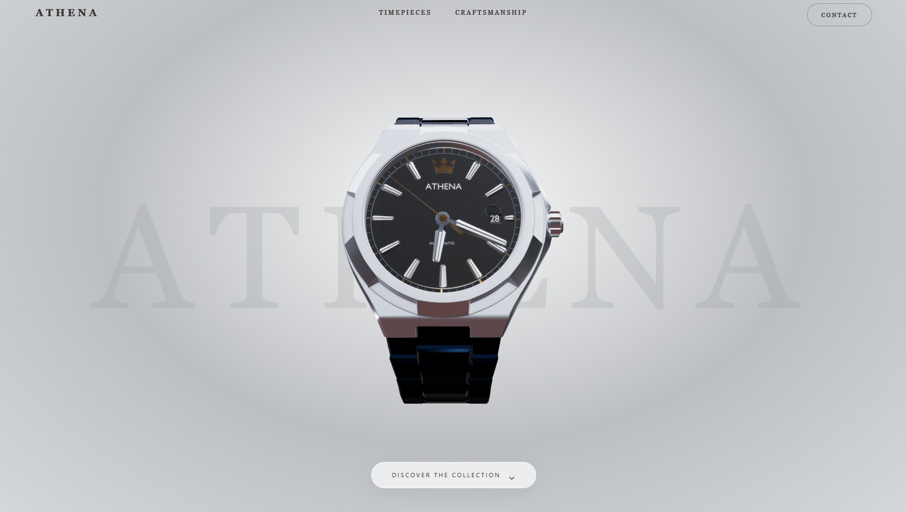
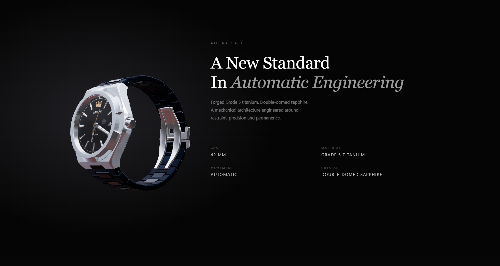
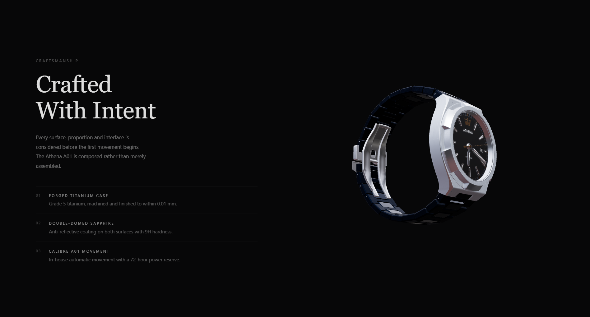
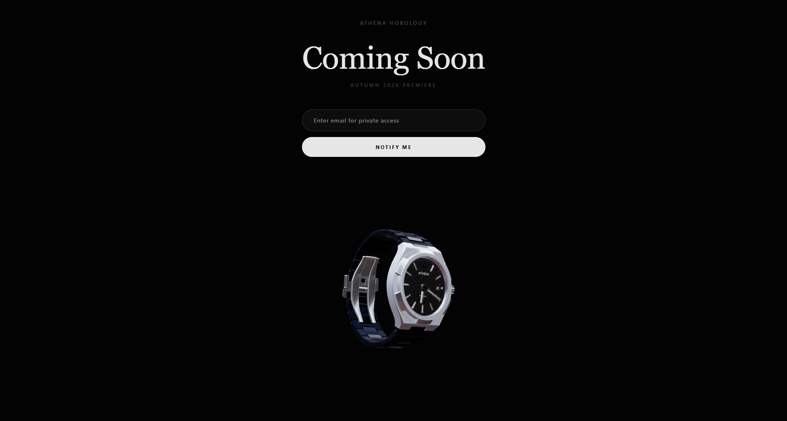

# Athena Horology

> A high-fidelity, interactive 3D luxury watch showcase — engineered for desktop.

Built with **Next.js 16**, **Three.js (React Three Fiber)**, and **Lenis smooth scrolling**, Athena delivers a cinematic scroll-driven experience around the A01 Calibre timepiece.

---

## Overview

Athena is a scroll-driven luxury product showcase for the Athena A01 — a Swiss-calibre automatic wristwatch. The experience is built around GPU-accelerated WebGL rendering, a kinetic frame preloader, and a choreographed Iris Aperture reveal sequence.

**Desktop only.** Viewports below 1024px display a luxury advisory fallback screen.

---

## Features

- **Iris Aperture Loading Sequence** — 91-frame kinetic animation preloaded into GPU `ImageBitmap` memory. Reveals the watch after all assets are in VRAM.
- **Session Cache Revalidation** — The loading screen only appears on a user's first visit. Subsequent reloads skip the loader and immediately serve assets from cache, playing the 10:10:30 hand calibration animation.
- **3D Watch Model** — Live Three.js `glTF` model with scroll-driven position, rotation, and scale keyframing across 4 sections.
- **Mechanical Clock Sweep** — Watch hands initialize at the 10:10:30 catalog pose and sweep smoothly to the user's live local time using quaternion-based rotation.
- **Lenis Smooth Scrolling** — Buttery hardware-accelerated scroll with easing locked during the loading sequence.
- **Mobile Fallback** — Responsive detection via `useResponsive` hook; narrow viewports receive a desktop advisory with a clipboard link.

---

## Tech Stack

| Layer | Technology |
|---|---|
| Framework | Next.js 16 (App Router, Turbopack) |
| 3D Rendering | Three.js via React Three Fiber + Drei |
| Scroll | Lenis |
| Language | TypeScript |
| Styling | Tailwind CSS + inline styles |
| Package Manager | pnpm |

---

## Project Structure

```
├── app/
│   ├── page.tsx                          # Master orchestrator (~160 lines)
│   └── components/
│       ├── loader/
│       │   ├── KineticFramePlayer.tsx    # GPU ImageBitmap 60fps canvas player
│       │   └── AthenaLoadingScreen.tsx   # Iris Aperture reveal overlay
│       ├── mobile/
│       │   └── MobileView.tsx            # 3D Hybrid mobile scroll & 360° inspection
│       ├── watch/
│       │   └── WatchModel.tsx            # 3D glTF watch + scroll keyframing
│       └── sections/
│           ├── Navbar.tsx
│           ├── HeroSection.tsx
│           ├── TimepieceSection.tsx
│           ├── CraftsmanshipSection.tsx
│           └── ComingSoonSection.tsx
│
├── lib/
│   ├── constants.ts                      # Frame paths, calibration poses, timings
│   ├── math.ts                           # smoothstep easing helper
│   ├── clockEngine.ts                    # Quaternion hand rotation engine
│   └── useResponsive.ts                  # Viewport width detection hook
│
└── public/
    ├── models/AthenaWatch.glb            # 3D watch model
    └── frames/                           # 91 kinetic preloader frames
```

---

## Screenshots

| Hero | Timepiece |
|------|----------|
|  |  |

| Craftsmanship | Coming Soon |
|------|----------|
|  |  |

---

## Getting Started

```bash
# Install dependencies
pnpm install

# Start development server
pnpm dev

# Production build
pnpm build
```

---

## Branch Strategy

| Branch | Purpose |
|---|---|
| `master` | Stable production branch (default) |
| `dev` | Active development |
| `feature/*` | Feature branches |
| `fix/*` | Bug fix branches |

---

## Viewport Requirements

The experience is engineered exclusively for large desktop screens. A minimum resolution of **1768 × 1382** is recommended. Anything below **1024px width** will display the mobile advisory screen.

---

*Athena Horology · A01 Calibre*
